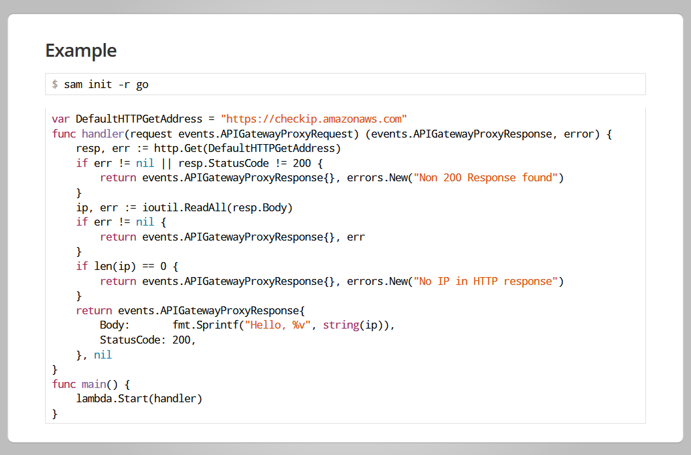

# present-templates

Slide template and static resources with code section syntax highlight for [golang.org/x/tools/cmd/present](https://godoc.org/golang.org/x/tools/cmd/present)

## Usage

```bash
go get golang.org/x/tools/cmd/present
git clone git@github.com:kalginnick/present-templates.git
present -base present-templates
```


